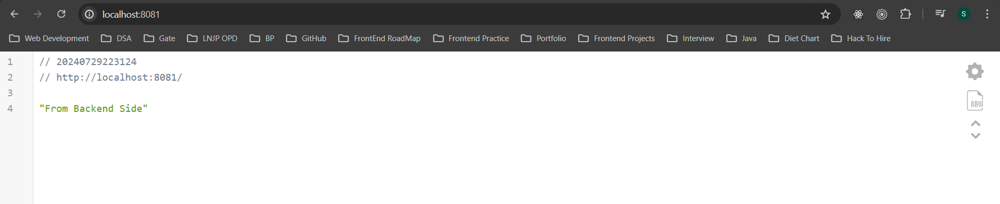

# Flight-Tracking-Application

## FRONTEND

**TECHNOLOGY STACK & Library USED IN FRONTEND:-**

1. HTML
2. CSS
3. React JS
4. React-Router-DOM

**PROJECT STRUCTURE**

1. I have created the react app using the following command :- **npx create-react-app Flight-Tracking-System**.
2. I have created two folders :- **Frontend** - that contains the code of User Interface. **Backend** that contains the code of server and database.
2. I have installed the routing library **react-router-dom** for the React. It helps to route to pages based on URL.
3. I have the changed the title of my website to **Flight Tracking System** in the index.html file present inside public folder.
4. I have changed the favicon for the website.
5. I have createa a **components folder** inside src folder that stores all the components that I have created in the website.
6. I have created a **css folder** inside src folder that stores the css of all the components that I have created in the website.
7. I have created an **image folder** inside src folder that stores all the images and icons that I have used in the website.
8. I have created a **util folder** inside src folder that stores the helper function. This helper function is used to check whether all the input fields are provided by the user or not. If all or any one of the input field is is not given by the user, it will show a pop mentioning that this particular input field/fields is/are required.

# Components Explanation

**1. App Component (App.js)**

    1. In this component, I have created the router instance (appRouter) that manages navigation and routing in a browser environment, with the provided array typically containing 2 route definitions. The route "/" renders the BodyComponent and the route "/checkFlightStatus" calls the CheckFlightStatusComponent.

    2. Then, I have provided this router instance (appRouter) to the RouterProvider which is used to provide the routing configuration defined by appRouter to the React application, enabling navigation and route management within the app.

    3. I have added css for this file in App.css file & it is present inside css folder.

**2. Body Component**

    1. BodyComponent displays the above UI. It consists of background image, heading (Check Flight Status) and a button (Check Status). 

    2. BodyComponent.css file which is present inside css folder is used to provide styling to this component.

    3. Once you click on Check Status button, it will change the route from "/" to "/checkFlightStatus and CheckFlightStatusComponent is rendered.

**3. Check Flight Status Component**

    1. CheckFlightStatusComponent displays the above UI. It consists of a white box that has a heading (Check Flight Status), Airline Name dropdown consisting of two options (Indigo & Air India), Flight No/ Flight Id (e.g. 6E 2341 - Indigo Flight Id, AI 142 - Air India Flight Id), Departure Date (data for which you have booked the flight), Show Flight Status Button, Reset Button.

    2. Once you click on Show Flight Status Button, it will check whether all fields are filled. If yes, it will show the flight details based on your input. If no, it will show a pop up telling these particular fields are required.

    3. Once you click on Show Flight Status Button, it will make an api call to "http://localhost:8081/flight" which will fetch the data from database using sql query and returns the data to the UI. Now, based upon the input fields that the user has filled, we will filter out the data on the basis of flight id or flight no and will pass the flight information to ShowSearchResult Component that is responsible for displaying the flight information. If the user has entered a wrong airline name or flight no or departure date then it will show {Sorry!! We cannot find any flight with the mentioned details.}

    4. Once you click on reset button, it will set the input fields (Airline Name, Flight No., Departure Date) to default value.

    5. I have added css for this file in CheckFlightStatusComponent.css file & it is present inside css folder.

**4. Show Search Result Component**

    1. ShowSearchResultComponent displays the above UI.

    2. If the entered input fields are correct, ShowSearchResultComponent will receive the flight information as props from CheckFlightStatusComponent which it will then display on the UI.
    
    3. ShowSearchResultComponent displays a heading (Searched Flight Status), Airline Name (e.g. Indigo), Flight Number (e.g. 6E 2341), Flight Status (e.g. On Time), Departure Time, Departure Gate, Arrival Time and Arrival Gate.

    4. I have added css for this file in ShowSearchResultComponent.css file & it is present inside css folder.

**5. Send Email**

    1. Whenever there is a change in the status of the flight like (status of the flight got changed from On Time to Cancelled), then an email will be send to all the passengers who have booked this flight by sending a post request to (http://localhost:8081/sendEmail) along with JSON stringified body which consists of passenger email, subject and text. This post api calls the sendMail function defined in the backend.

**How To Run Frontend Folder**

    1. Inside the terminal, use cd to go to the Frontend Directory.
    2. Run npm install to install the required packages.
    3. Run npm start to start the application.

## BACKEND

**TECHNOLOGY STACK & TOOLS USED IN BACKEND:-**

1. Express.js
2. Nodemailer
3. Nodemon
4. MySQL

**SERVER - (Using Express JS)**

    1. In the server.js file, I have created a server that is running on port # (8081). 

    2. I have created a connection between mysql database 
    and the server.
    
    3. I have created a get api for fetching flights information stored in database.
    
    4. I have created a post api that is used to send email to all the passengers whose flight either has been delayed or cancelled or their departure or arrival gate has been changed.

**SEND EMAIL (Using NodeMailer)**
    1. I have created a nodemailer transporter using SMTP.
    2. Using transporter, call sendMail method which take message option object as input. Message option object consists of sender email, receiver email, subject, text.

**How To Run Backend Folder**
    1. Inside the terminal, use cd to go to the Backend Directory.
    2. Run npm install to install the required packages.
    3. Run npm start to start the server.

## DATABASE

    1. I have created the database using MySQL (phpMyAdmin).

**How To Create MySQL Database**

    1. Install & open XAMPP application in your computer.

    2. Install MySQL & Apache module by clicking on the checkboxes. 
    
    3. Now click on start button to start the modules.
    
    4. Once you have completed the above procedure, open your browser and type https://localhost/phpmyadmin/.
    
    5. You can now use your phpmyadmin to create a database by adding columns and data.
